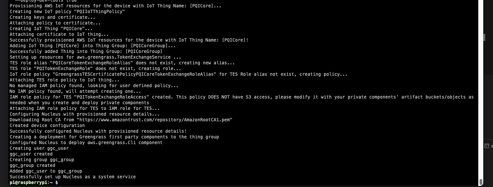

# Prepare raspberry pi for edge setup to support greengrass deployment

## 1. Install Raspbian OS 64 bit with desktop
Use [raspberry pi imager](https://www.raspberrypi.com/software/) to install Raspbian OS 64 bit with desktop.
Configure:
- allow ssh
- set wifi

## 2. Install greengrass v2

1. ssh into pi
2. install java, run below and wait a while..
```
yes Y | sudo apt-get update
sudo apt-get upgrade
sudo apt install default-jdk
```
3. Install the AWS IoT Greengrass Core software ([based on Step 3 here](https://docs.aws.amazon.com/greengrass/v2/developerguide/getting-started.html#install-greengrass-v2))

* Install greengrass installer
```
cd ~
curl -s https://d2s8p88vqu9w66.cloudfront.net/releases/greengrass-nucleus-latest.zip > greengrass-nucleus-latest.zip
unzip greengrass-nucleus-latest.zip -d GreengrassInstaller && rm greengrass-nucleus-latest.zip
```
* install aws cli v2
```
curl "https://awscli.amazonaws.com/awscli-exe-linux-aarch64.zip" -o "awscliv2.zip"
unzip awscliv2.zip
sudo ./aws/install
```
* Authenticate aws cli, either via installing saml2aws or export your local env | grep AWS variables after ao'ing into aws account (if `aws s3 ls` works your are ready for last step.)


* For Step 3.4 `Run the following command to launch the AWS IoT Greengrass Core software installer` 
We use the below code snippet:
```
sudo -E java -Droot="/greengrass/v2" -Dlog.store=FILE \
  -jar ./GreengrassInstaller/lib/Greengrass.jar \
  --aws-region eu-west-1 \
  --thing-name PQICore \
  --thing-group-name PQICoreGroup \
  --thing-policy-name PQIIoTThingPolicy \
  --tes-role-name PQITokenExchangeRole \
  --tes-role-alias-name PQICoreTokenExchangeRoleAlias \
  --component-default-user ggc_user:ggc_group \
  --provision true \
  --setup-system-service true \
  --deploy-dev-tools true
```
Example console output:


Your raspberry pi edge is now ready to receive greengrass deployments.  
[Optional] Go to aws console -> IoT Core to see if the device is registered.

## 3. Install opencv on your raspberry pi
Follow this guide: https://qengineering.eu/install-opencv-4.5-on-raspberry-64-os.html 

1. make sure memory swap is 2gb (see https://qengineering.eu/install-raspberry-64-os.html) -> Memory swapping.


```
# remove the old dphys version
$ sudo /etc/init.d/dphys-swapfile stop
$ sudo apt-get remove --purge dphys-swapfile
# release 2 GB of disk space used by the old dphys version
$ sudo rm /var/swap
# install zram
$ sudo wget -O /usr/bin/zram.sh https://raw.githubusercontent.com/novaspirit/rpi_zram/master/zram.sh
# set autoload
$ sudo nano /etc/rc.local
# add the next line before exit 0
/usr/bin/zram.sh &
# save with <Ctrl+X>, <Y> and <Enter>
```


```
$ sudo chmod +x /usr/bin/zram.sh
$ sudo nano /usr/bin/zram.sh
mem=$((  $totalmem * 512 ))
# save with <Ctrl+X>, <Y> and <Enter>
$ sudo reboot
```

2. Prepare for open cv:

```
# to get the current status
$ sudo rpi-eeprom-update
# if needed, to update the firmware
$ sudo rpi-eeprom-update -a
$ sudo reboot
```

3. Install opencv 4.5.5
```
# check your memory first
$ free -m
# you need at least a total of 6.5 GB!
# if not, enlarge your swap space as explained in the guide
$ wget https://github.com/Qengineering/Install-OpenCV-Raspberry-Pi-64-bits/raw/main/OpenCV-4-5-5.sh
$ sudo chmod 755 ./OpenCV-4-5-5.sh
$ ./OpenCV-4-5-5.sh
```